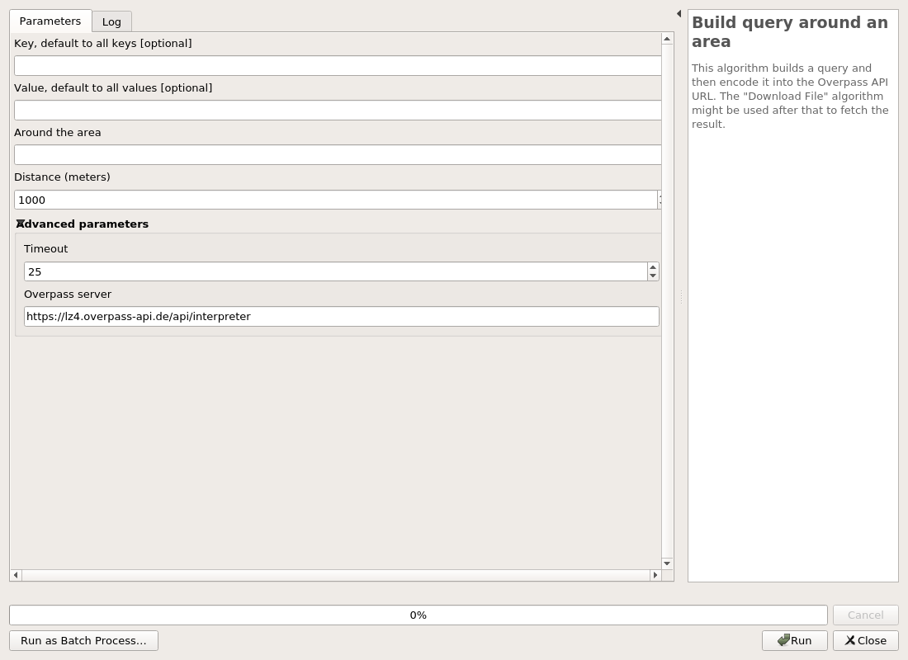
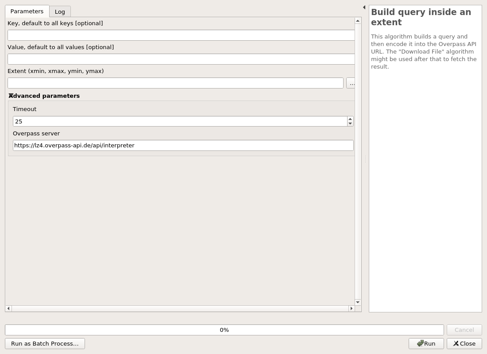
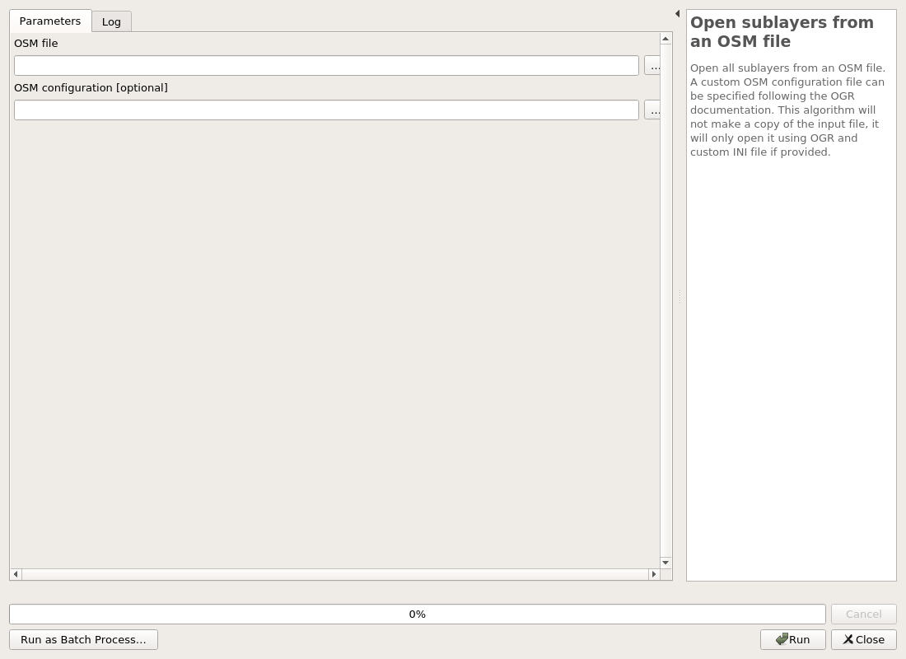

---
Title: QuickOSM
Favicon: ../icon.png
...

[TOC]

# QuickOSM

## Advanced

### Build query around an area

This algorithm builds a query and then encode it into the Overpass API URL. The "Download File" algorithm might be used after that to fetch the result.

#### Parameters

| ID | Description | Type | Info | Required | Advanced |
|:-:|:-:|:-:|:-:|:-:|:-:|
KEY|Key, default to all keys|String||||
VALUE|Value, default to all values|String||||
AREA|Around the area (Point WKT accepted)|String||✓||
DISTANCE|Distance (meters)|Number||✓||
TIMEOUT|Timeout|Number||✓|✓|
SERVER|Overpass server|String||✓|✓|

#### Outputs

| ID | Description | Type | Info |
|:-:|:-:|:-:|:-:|
OUTPUT_URL|Query as encoded URL|String||
OUTPUT_OQL_QUERY|Raw query as OQL|String||

***

### Build query by attribute only

This algorithm builds a query and then encode it into the Overpass API URL. The "Download File" algorithm might be used after that to fetch the result.

#### Parameters

| ID | Description | Type | Info | Required | Advanced |
|:-:|:-:|:-:|:-:|:-:|:-:|
KEY|Key, default to all keys|String||||
VALUE|Value, default to all values|String||||
TIMEOUT|Timeout|Number||✓|✓|
SERVER|Overpass server|String||✓|✓|

#### Outputs

| ID | Description | Type | Info |
|:-:|:-:|:-:|:-:|
OUTPUT_URL|Query as encoded URL|String||
OUTPUT_OQL_QUERY|Raw query as OQL|String||

***

### Build query inside an extent

This algorithm builds a query and then encode it into the Overpass API URL. The "Download File" algorithm might be used after that to fetch the result.

#### Parameters

| ID | Description | Type | Info | Required | Advanced |
|:-:|:-:|:-:|:-:|:-:|:-:|
KEY|Key, default to all keys|String||||
VALUE|Value, default to all values|String||||
EXTENT|Extent|Extent||✓||
TIMEOUT|Timeout|Number||✓|✓|
SERVER|Overpass server|String||✓|✓|

#### Outputs

| ID | Description | Type | Info |
|:-:|:-:|:-:|:-:|
OUTPUT_URL|Query as encoded URL|String||
OUTPUT_OQL_QUERY|Raw query as OQL|String||

***

### Build query inside an area

This algorithm builds a query and then encode it into the Overpass API URL. The "Download File" algorithm might be used after that to fetch the result.

#### Parameters

| ID | Description | Type | Info | Required | Advanced |
|:-:|:-:|:-:|:-:|:-:|:-:|
KEY|Key, default to all keys|String||||
VALUE|Value, default to all values|String||||
AREA|Inside the area|String||✓||
TIMEOUT|Timeout|Number||✓|✓|
SERVER|Overpass server|String||✓|✓|

#### Outputs

| ID | Description | Type | Info |
|:-:|:-:|:-:|:-:|
OUTPUT_URL|Query as encoded URL|String||
OUTPUT_OQL_QUERY|Raw query as OQL|String||

***

### Build raw query

None

#### Parameters

| ID | Description | Type | Info | Required | Advanced |
|:-:|:-:|:-:|:-:|:-:|:-:|
QUERY|Query|String||✓||
EXTENT|Extent, if "{{bbox}}" in the query|Extent||||
SERVER|Overpass server|String||✓|✓|
AREA|Area (if you want to override {{geocodeArea}} in the query)|String|||✓|

#### Outputs

| ID | Description | Type | Info |
|:-:|:-:|:-:|:-:|
OUTPUT_URL|Query as encoded URL|String||
OUTPUT_OQL_QUERY|Raw query as OQL|String||

***

### Open sublayers from an OSM file

Open all sublayers from an OSM file. A custom OSM configuration file can be specified following the OGR documentation. This algorithm will not make a copy of the input file, it will only open it using OGR and custom INI file if provided.

#### Parameters

| ID | Description | Type | Info | Required | Advanced |
|:-:|:-:|:-:|:-:|:-:|:-:|
FILE|OSM file|File||✓||
OSM_CONF|OSM configuration|File||||

#### Outputs

| ID | Description | Type | Info |
|:-:|:-:|:-:|:-:|
OUTPUT_POINTS|Output points|VectorLayer||
OUTPUT_LINES|Output lines|VectorLayer||
OUTPUT_MULTILINESTRINGS|Output multilinestrings|VectorLayer||
OUTPUT_MULTIPOLYGONS|Output multipolygons|VectorLayer||
OUTPUT_OTHER_RELATIONS|Output other relations|VectorLayer||

***

