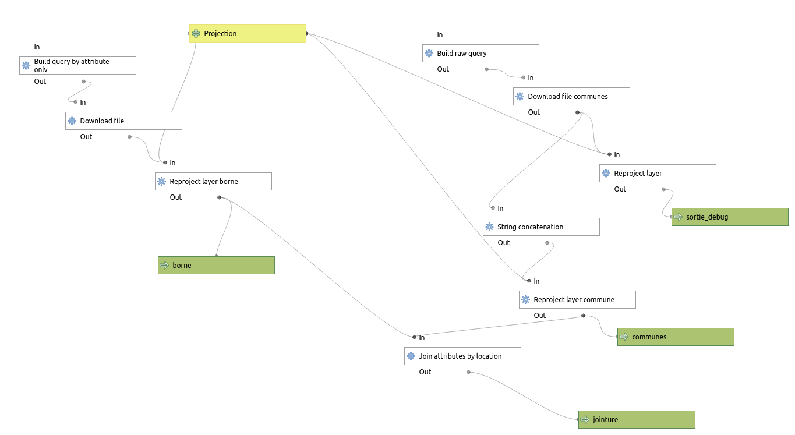

# Using QGIS Processing

For the list of algorithms, read the [Processing](./processing/) section.

Since QGIS 3.4, QuickOSM is available in the
[Processing modeler](https://docs.qgis.org/latest/en/docs/user_manual/processing/modeler.html).

Here some useful algorithms in an appropriate order:

* **QuickOSM** → **Advanced**, one of the **Build query** algorithms.
* **File Tools** → **Download file**, by using the `Encoded URL` as a input parameter from the previous algorithm.
* To process the OSM file : 
    * Either **Modeler Tools** → **String concatenation**.
    Useful to concatenate the downloaded filepath with
      * `|layername=points`
      * `|layername=lines`
      * `|layername=multilinestrings`
      * `|layername=multipolygons`
    * Or **QuickOSM** → **Open OSM file**. Instead of the step above with the string concatenation.
* Then it's up to you to combine other QGIS algorithms.

Check a more detailed answer on [stackexchange](https://gis.stackexchange.com/a/313360/24505) :

* **Vector Table** → **Explode HStore field** (QGIS ≥ 3.6)
* **Vector Table** → **Feature filter**

Since QGIS 3.6, you can export your Processing model as a Python script. You can
also call these algorithms individually from the QGIS Python Processing framework.

As an example, you can download [this model](https://github.com/3liz/QuickOSM/blob/master/QuickOSM/resources/model/osm_download_style.model3) and
[load it in your QGIS](https://docs.qgis.org/latest/en/docs/user_manual/processing/modeler.html#saving-and-loading-models).
Additionally, you can download example QGIS style files for OSM from [here](https://github.com/anitagraser/QGIS-resources/tree/master/qgis2/osm_spatialite).
The model will download and style OSM data from an extent and packages it in one Geopackage.
